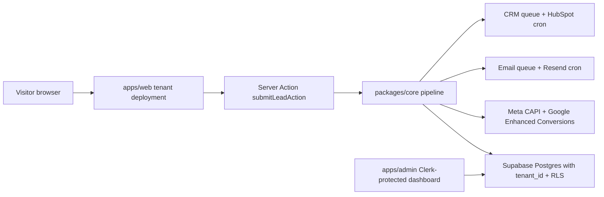
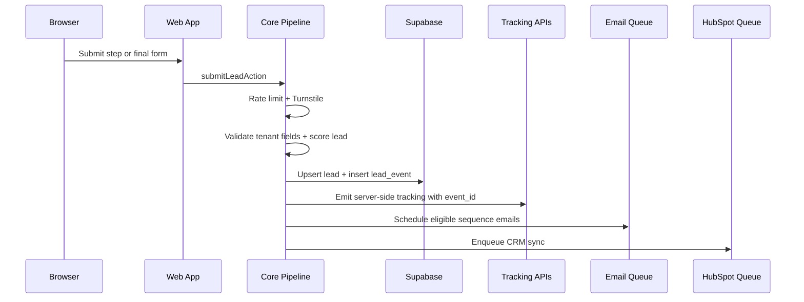

# Architecture

Base Lead Engine is a pnpm/Turborepo monorepo for launching tenant-specific lead funnels without writing new funnel code for standard quiz, calculator, and form offers.

## System Shape

## Tenant Model

- Each tenant gets one Vercel project for `apps/web`.
- The deployment sets `TENANT_SLUG=<slug>`.
- Tenant config lives in `packages/tenants/<slug>/config.ts` and is validated by the Zod schema in `packages/tenants/_schema`.
- Public funnel routing can also resolve a tenant by hostname through `apps/web/middleware.ts`.
- Every database table includes `tenant_id`; application queries write it explicitly and Supabase RLS is the safety net.

## Lead Lifecycle

## Key Decisions

- Server-side tracking is primary; client pixels are fallback and dedupe through `event_id`.
- Email and CRM work are queue-based through Supabase tables and Vercel Cron routes.
- External HTTP calls use a shared retry wrapper for 429 and 5xx responses.
- Admin auth is Clerk with a single configured email allowlist for the MVP.
- Production rate limiting uses Upstash Redis REST; local development falls back to in-memory counters.
