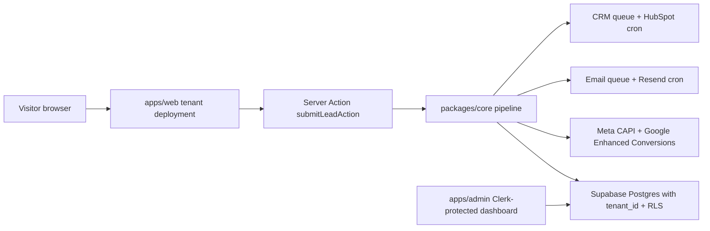
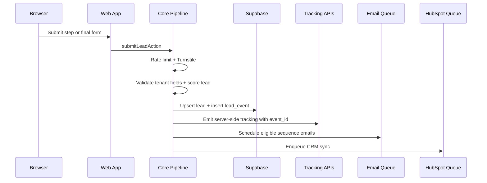

# Architecture

Base Lead Engine is a pnpm/Turborepo monorepo for launching tenant-specific lead funnels without writing new funnel code for standard quiz, calculator, and form offers.

## System Shape

## Tenant Model

- Each tenant gets one Vercel project for `apps/web`.
- The deployment sets `TENANT_SLUG=<slug>`.
- Tenant config lives in `packages/tenants/<slug>/config.ts` and is validated by the Zod schema in `packages/tenants/_schema`.
- Public funnel routing can also resolve a tenant by hostname through `apps/web/middleware.ts`.
- Every database table includes `tenant_id`; application queries write it explicitly and Supabase RLS is the safety net.
- Public funnel database writes are server-mediated through Server Actions and the service-role client. Direct browser-to-Supabase access is deferred until Clerk JWT templates include a tenant-scoped `tenant_id` claim.

## Lead Lifecycle

## Key Decisions

- Server-side tracking is primary; client pixels are fallback and dedupe through `event_id`.
- Email and CRM work are queue-based through Supabase tables and Vercel Cron routes.
- External HTTP calls use a shared retry wrapper for 429 and 5xx responses.
- Admin auth is Clerk with a single configured email allowlist for the MVP. Admin Supabase access uses the service-role key only from server-side admin code so the owner dashboard can read across tenants without exposing privileged credentials to browsers.
- Production rate limiting uses Upstash Redis REST; local development falls back to in-memory counters.
- Next.js is pinned to `15.5.7`. Framework upgrades should be intentional work items with the full typecheck, lint, test, and build suite.
- Google Enhanced Conversions uses a tenant-configurable HTTPS endpoint by default. The tracking interface remains isolated so direct Google Ads API OAuth can replace the transport once credentials and account shape are known.
- Pre-email progress is browser-local only. A Supabase lead row is created once email is captured so records remain contactable and deduplicable.
- Email sending uses direct Resend REST calls behind the email-engine interface. Unsubscribe links use HMAC tokens when `UNSUBSCRIBE_SIGNING_SECRET` is configured.
- HubSpot sync uses the known default association type IDs for deal-to-contact and note-to-contact, with staging verification required before production traffic.
- High-score notifications are opportunistic: Slack and email notifications send only when tenant credentials are configured and never block lead capture.
- Bot protection, Sentry, and rate limiting are credential-gated. Production should configure Turnstile, Sentry, and Upstash; local development keeps safe fallbacks for build and test workflows.
